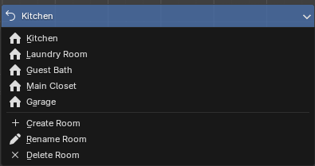
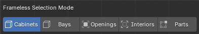
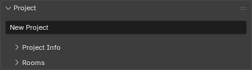
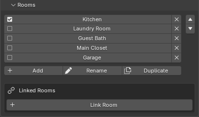
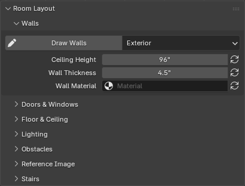
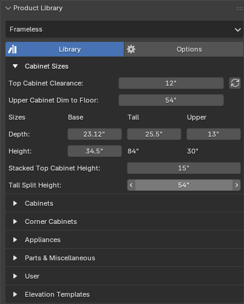
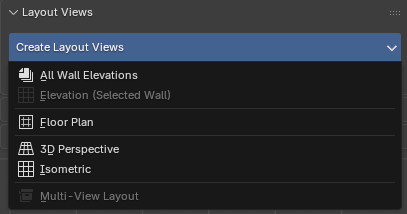
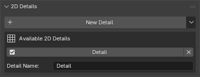
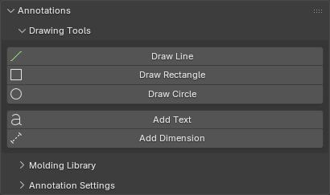

# Getting Started

This page covers the Home Builder sidebar interface — each panel and what it's used for. The sidebar is located in the 3D Viewport. Press **N** to toggle it open, then click the **Home Builder** tab.

For a general video overview of how to design with Home Builder, check out this walkthrough:

  <iframe src="https://www.youtube.com/embed/TZ4Q_26fDDc" style="position: absolute; top: 0; left: 0; width: 100%; height: 100%;" frameborder="0" allowfullscreen></iframe>

---

## Room Selector

At the top of the sidebar you'll see a dropdown showing the current room name. Click it to switch between rooms or create a new one. Every room in your project is its own Blender scene, so switching rooms switches the entire scene.

Below the room selector is the **Frameless Selection Mode** bar. This controls what gets selected when you click on cabinets in the viewport:

- **Cabinets** — Selects the entire cabinet. This is the default and what you'll use most of the time.
- **Bays** — Selects individual bay sections within a cabinet. Right Click on a bay to change the entire bay configuration.
- **Openings** — Selects openings (the spaces where doors or drawers go).
- **Interiors** — Selects interior components like shelves and dividers.
- **Parts** — Selects individual parts (panels, backs, toe kicks, etc.).

!!! tip
    If you right-click a cabinet and don't see the options you expect, check which selection mode you're in.

    Objects will be shaded in blue depending on your selection mode.
---

## Project

The Project panel stores information about your project and manages your rooms.

### Project Info

Collapsible subpanel where you enter project details: project name, number, date, designer info (name, phone, email), client info (name, address, phone, email), and notes.

### Rooms

Lists all rooms in your project. Click a room name to switch to it. You can add, rename, duplicate, and delete rooms from here. Use the up/down arrows to reorder rooms.

**Linked Rooms** lets you bring geometry from another room into the current one. This is useful when rooms share a wall or when you want to see adjacent rooms for context. You can toggle which elements are linked: walls, lights, and/or products.

---

## Room Layout

This is where you build the physical space — walls, doors, windows, and everything that defines the room before you start placing cabinets.

### Walls

Click **Draw Walls** to start drawing. Click points to place wall segments, type numbers to enter exact lengths, and press **Esc** or right-click to finish. The dropdown next to the button lets you choose the wall type:

- **Exterior** — Standard full-height walls.
- **Interior** — Same as exterior but tagged differently for reference.
- **Half** — Partial-height walls (like a knee wall or pony wall).
- **Fake** — Non-physical walls used as placement surfaces for cabinets in open areas.

Below the draw button you'll find controls for ceiling height, wall thickness, and wall material. The refresh buttons next to each property apply the change to all walls in the current room.

### Doors & Windows

Place entry doors and windows onto walls. Click the **Door** or **Window** button, then click on a wall to place it. Right-click the placed object to access its prompts and adjust dimensions.

The **Show Entry Door and Window Cages** toggle controls whether the bounding boxes for doors and windows are visible in the viewport.

!!! info "Under Development"
    Doors and Windows show a simple cutout. Geometry for Door, Windows, and Hardware will be added soon.

### Floor & Ceiling

Adds a floor plane and/or ceiling to the room. These are primarily for visual context and rendering.

### Lighting

- **Add Room Lights** — Places lights in the room for better viewport visualization and rendering.
- **Setup World Lighting** — Configures the scene's ambient/world lighting.

Once lights are added, you'll see options to update or delete them.

### Obstacles

Place obstacles on walls to represent things like outlets, switches, vents, pipes, and other objects that cabinets need to work around. Select an obstacle type from the dropdown, set its dimensions, and click **Place Obstacle** to position it on a wall.

Obstacles appear in a list below the placement controls so you can select or delete them. Cabinets placed near obstacles will recognize them and adjust accordingly.

!!! info "Under Development"
    Obstacles just show simple geometry to help you plan your space. Geometry for common obstacles will be added soon.

### Reference Image

Drag an image file (like a floor plan scan or architect's drawing) into the 3D viewport to use as a tracing reference. Once an image is loaded, this panel shows controls for scaling the image to real-world dimensions using the **Set Image Scale** tool, adjusting display size, offset, opacity, and visibility settings.

### Stairs

Place a staircase in your room. Click **Place Stairs** to position it, then right-click to open the stair prompts where you can adjust width, total rise, riser height, tread depth, and material thickness. The number of steps and total run are calculated automatically.

---

## Product Library

This is where you place cabinets, appliances, and other products. The dropdown at the top lets you switch between product libraries:

- **Frameless** — European-style frameless cabinet construction.
- **Face Frame** — Traditional face frame cabinet construction. (Coming Soon)
- **Closets** — Closet system components. (Coming Soon)

Each library has its own set of products organized by category (base cabinets, upper cabinets, tall cabinets, appliances, etc.). Products are placed by clicking the product button and then clicking on a wall in the viewport. Cabinets automatically snap to walls and adjacent cabinets.

Right-click any placed product to access its **Prompts** — this is where you configure dimensions and other settings. Depending on your selection mode different options will be available.

!!! info "Cabinet Styles"
    Each product library has a styles system where you can configure default finishes, door styles, materials, and construction options that apply to all new cabinets. Access it through the library Options Tab.

---

## Layout Views

Create 2D technical drawings from your 3D design. Click the **Create Layout Views** dropdown to choose a view type:

- **All Wall Elevations** — Creates elevation drawings for every wall in the room at once.
- **Elevation (Selected Wall)** — Creates an elevation drawing of whichever wall is currently selected.
- **Floor Plan** — Creates a top-down plan view of the room.
- **3D Perspective** — Creates a perspective camera view.
- **Isometric** — Creates an isometric (non-perspective) camera view.
- **Multi-View Layout** — Creates a combined sheet with multiple views of a cabinet group.

Layout views appear in a list below the create button. Click a view name to switch to it, click the refresh icon to update an elevation after making changes, and click X to delete it. Use the up/down arrows to reorder views — this controls page order in PDF exports.

### Page Settings

Only visible when you're inside a layout view. Set the paper size, scale, rename the view, and access the **Render** and **Export PDF** buttons. Export PDF generates a PDF document containing all layout views in your project.

### Insert 2D Details

Only visible when you're inside a layout view. Lists any 2D details you've created (see below) and lets you insert them into the current layout page.

---

## 2D Details

Create custom 2D detail drawings — things like molding profiles, construction details, or section views that you want to include in your layout pages.

Click **New Detail** to create a blank detail view. The library menu (arrow icon) lets you save and load details so you can reuse them across projects. Details appear in a list where you can switch between them, reorder them, and delete them.

Once inside a detail view, use the **Annotations** panel tools (below) to draw lines, shapes, add dimensions, and build your detail drawing.

---

## Annotations

Tools for adding 2D markup to layout views and detail views.

### Drawing Tools

- **Draw Line** — Click two points to draw a straight line. Type a number to enter an exact length. Hold **Alt** to change the angle.
- **Draw Rectangle** — Click two corners to draw a rectangle.
- **Draw Circle** — Click center and edge to draw a circle.
- **Add Text** — Places a text annotation that you can edit.
- **Add Dimension** — Click two points to place a dimension line that automatically displays the measured distance.

### Molding Library

Only visible in detail views. Browse and place molding profiles by category. Select a category and molding from the dropdowns, preview the thumbnail, and click **Add Molding Profile** to place it. **Add Solid Lumber** places a simple rectangular lumber cross-section.

### Edit Tools

Only visible when a curve object is selected. Provides tools for modifying drawn curves:

- **Add Fillet/Radius** — Rounds a corner on a curve (available in edit mode).
- **Offset Curve** — Creates a parallel offset copy of a curve.

### Annotation Settings

Configure default appearance for annotations: line thickness and color, text font/size/color, and dimension text size, tick length, and line thickness. Click **Apply to All Annotations** to update all existing annotations in the current view with these settings.
