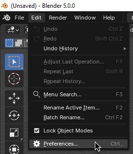
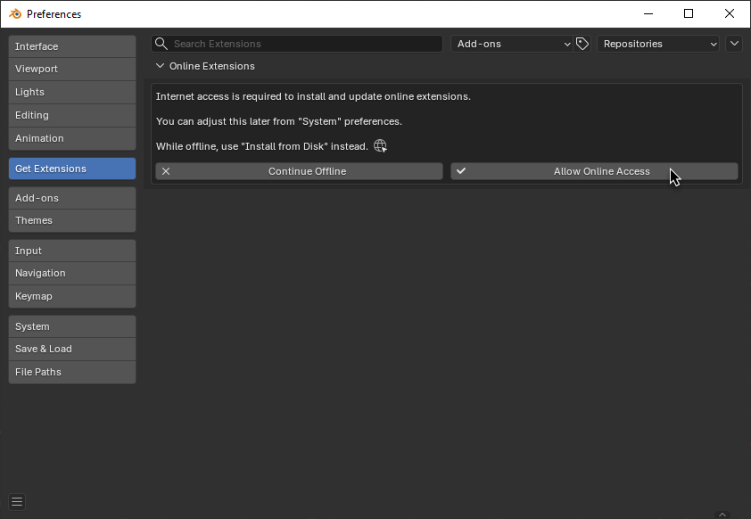
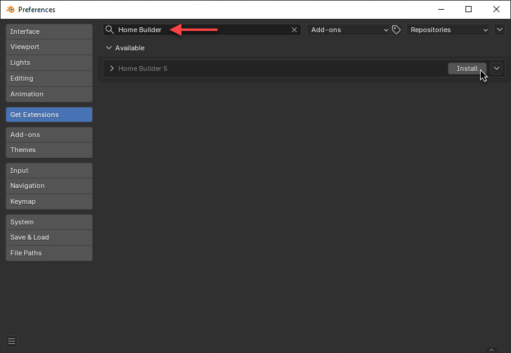
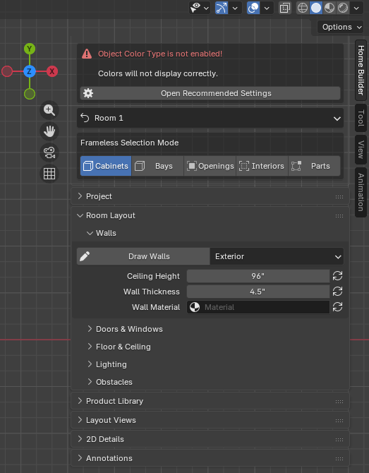

# Installation

## Requirements

- [**Blender 5.0**](https://www.blender.org/download/)
- Windows, macOS, or Linux

Home Builder is available on the [Blender Extensions Platform](https://extensions.blender.org/add-ons/home-builder-5/)

## Install from Extensions Platform

This is the easiest way to install Home Builder 5.

1. Go to Edit → Preferences.

    

2. In the `Get Extensions` Tab click `Allow Online Access`.

    

3. Search for Home Builder, and click Install.

    

## Install from Disk

If you would rather install the add-on manually follow these steps.

1. Download the latest release `.zip` [Home Builder 5 Download](https://creativedesigner3d.wordpress.com/wp-content/uploads/2026/02/home_builder_5-5.0.0.zip)
2. Open Blender
3. Go to **Edit → Preferences → Add-ons**
4. Open the dropdown menu (top-right) and select **Install from Disk...**
5. Select the downloaded `.zip` file

!!! warning "Don't extract the ZIP"
    Install the `.zip` file directly. Do not unzip it first.

## Verify Installation

After installing, press ++n++ in the 3D Viewport to open the sidebar. You should see a **Home Builder** tab.

If you see a warning about "Object Color Type is not enabled", click **Open Recommended Settings** to configure Blender for Home Builder.

