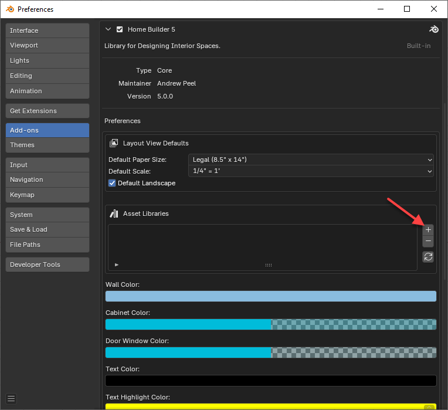
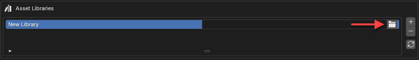
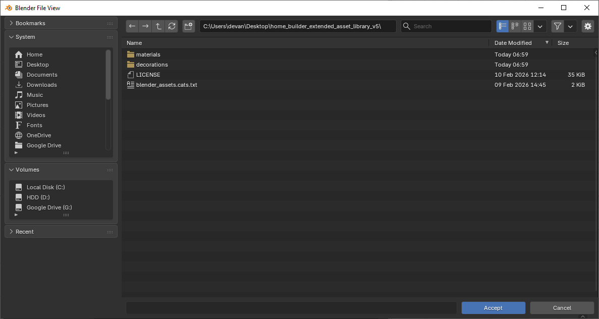
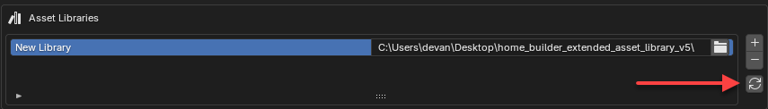
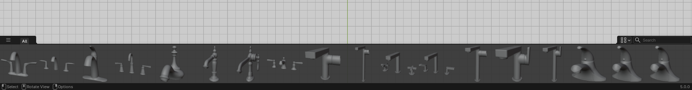
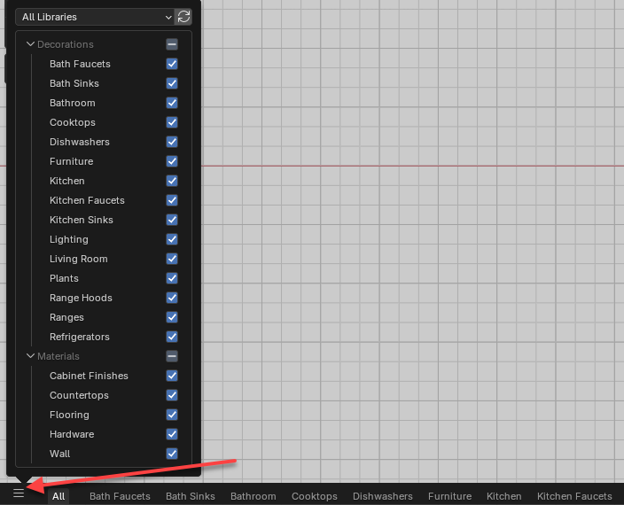

# Installing Additional Assets

## Installing the Extended Asset Library

If you want to support the development of Home Builder and get access to additional assets you can purchase the extended asset library.

1. Purchase and Download the [Extended Asset Library](https://creativedesigner3d.com/extended-asset-library/)
2. Open Blender
3. Go to **Edit → Preferences → Add-ons**
4. Find the Home Builder add-on.
5. Add an external library. 

    
    
    
6. Click the Folder Icon and set the path to where you saved the extended asset library. Navigate to the folder that contains the `materials` and `decorations` folders, then click the `Accept` button at the bottom right of the File View dialog.

    

7. Once the path is set click the `Refresh` button.

    

8. The Assets will show in the asset shelf at the bottom of the interface. If the interface doesn't appear, click the arrow button at the bottom right of the interface.

    

9. If you click the catalog selector icon. You can enable the tabs you want to appear in the asset shelf.

    

10. Drag and drop the assets into the 3D viewport.